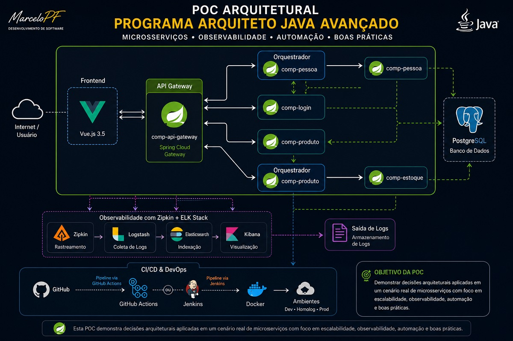

  

# PoC Arquitetural

Esta PoC foi desenvolvida como base prática do **Programa Arquiteto Java Avançado**, permitindo demonstrar decisões arquiteturais aplicadas em cenários próximos à realidade encontrada em ambientes corporativos.

Mais do que apresentar tecnologias isoladas, esta PoC busca evidenciar como componentes distribuídos podem ser organizados, integrados, monitorados e evoluídos ao longo do tempo.

---

## O que é esta PoC?

A PoC (Proof of Concept) representa um ambiente arquitetural utilizado como fio condutor da formação, conectando conceitos teóricos a uma implementação prática.

Seu propósito não é servir como um produto pronto para produção, mas sim apoiar a compreensão de decisões arquiteturais reais e estimular o desenvolvimento do pensamento sistêmico necessário para atuação em nível arquitetural.

---

## Por que esta PoC existe?

Arquitetura de software vai muito além de diagramas e apresentações conceituais.

A PoC foi criada para permitir que profissionais experientes observem como diferentes componentes se relacionam dentro de um ecossistema distribuído, compreendendo os impactos das decisões técnicas sobre escalabilidade, integração, observabilidade e evolução contínua dos sistemas.

> **O objetivo não é apenas demonstrar tecnologias, mas ajudar profissionais a compreenderem como arquiteturas modernas são concebidas, sustentadas e evoluídas ao longo do tempo.**

---

## Visão arquitetural da PoC

  

A arquitetura apresentada demonstra uma possível organização de componentes em um cenário distribuído, evidenciando responsabilidades distintas e estratégias de integração adotadas ao longo da formação.

---

## O que você encontrará nesta PoC?

Ao longo desta PoC, serão explorados aspectos como:

* Estruturação de microsserviços;
* Estratégias de orquestração entre componentes;
* Integração entre frontend e backend;
* Utilização de API Gateway como ponto central de entrada;
* Persistência de dados em cenários distribuídos;
* Observabilidade e rastreamento de execução;
* Estratégias de centralização e análise de logs;
* Automação de processos relacionados ao ciclo de entrega;
* Infraestrutura tratada como parte das decisões arquiteturais;
* Evolução arquitetural orientada às necessidades do negócio.

---

## Componentes demonstrados

Esta PoC apresenta, entre outros elementos:

* Frontend desenvolvido com Vue.js;
* API Gateway baseado em Spring Cloud Gateway;
* Microsserviços especializados;
* Componentes orquestradores;
* Persistência utilizando PostgreSQL;
* Rastreamento distribuído com Zipkin;
* Centralização de logs utilizando Elastic Stack;
* Estratégias de containerização com Docker;
* Automação por meio de pipelines de CI/CD.

---

## Decisões arquiteturais exploradas

Ao longo da jornada, esta PoC apoia discussões relacionadas a temas como:

* Separação de responsabilidades;
* Redução de acoplamento entre componentes;
* Evolução incremental da arquitetura;
* Observabilidade como preocupação arquitetural;
* Automação como suporte à qualidade e previsibilidade;
* Infraestrutura como elemento estratégico;
* Trade-offs envolvidos nas decisões técnicas;
* Sustentação de ambientes distribuídos.

---

## Desenvolvendo o pensamento arquitetural

A PoC não busca apenas demonstrar tecnologias.

Seu principal objetivo é apoiar o desenvolvimento da capacidade de compreender sistemas complexos, avaliar cenários, identificar impactos e ampliar a maturidade necessária para tomadas de decisão mais conscientes.

Ao explorar os diferentes componentes e suas interações, profissionais experientes são convidados a enxergar a arquitetura sob uma perspectiva mais ampla, conectando aspectos técnicos, operacionais e estratégicos.

---

## Relação com o Programa Arquiteto Java Avançado

Dentro do programa, esta PoC atua como elemento integrador da formação.

Enquanto os capítulos apresentam conceitos, práticas e fundamentos, a PoC oferece o contexto necessário para visualizar essas decisões em funcionamento.

Ela representa o elo entre teoria e prática.

🌐 <a href="https://programa.systemasweb.com.br">Programa Arquiteto Java Avançado</a> 

---

## Sobre esta iniciativa

Esta PoC foi desenvolvida com propósito educacional e representa um ambiente rico para compreensão de arquiteturas distribuídas, observabilidade, integração entre componentes e práticas adotadas em cenários reais.

Seu objetivo é apoiar o desenvolvimento do pensamento arquitetural, servindo como referência para estudos, experimentações e evolução técnica de profissionais e equipes que desejam ampliar sua capacidade de tomar decisões arquiteturais mais conscientes.

---

## Sobre o autor

Desenvolvido e mantido por **Marcelo Ferreira**, Arquiteto de Software, fundador da **Systemasweb** e criador do **Programa Arquiteto Java Avançado**.

Com mais de **17 anos de experiência**, atua na construção, evolução e sustentação de sistemas corporativos, compartilhando experiências práticas adquiridas em projetos reais e transformando-as em jornadas estruturadas de aprendizagem voltadas à evolução técnica e arquitetural.

➡️ <a href="https://github.com/MarceloPF">Github MarceloPF</a>
# poc
PoC arquitetural utilizada como base do Programa Arquiteto Java Avançado, demonstrando microsserviços, integração entre componentes, observabilidade, Docker, CI/CD e decisões arquiteturais aplicadas a cenários reais.
